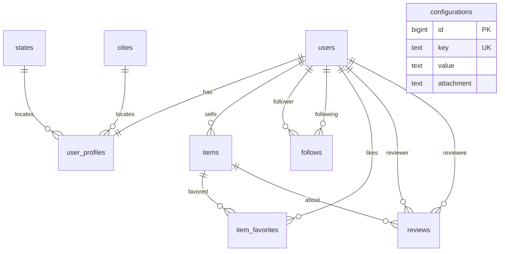

# Perfil de loja + geolocalização + Configurações

## Contexto

- Perfil público hoje: [`frontend/src/app/usuario/[id]/page.tsx`](frontend/src/app/usuario/[id]/page.tsx) + [`backend/handlers/profile.go`](backend/handlers/profile.go) — avatar, bio, contagem de anúncios; **sem** banner, seguir, avaliação, status vendido, busca na loja.
- Catálogo geo já existe (`countries` / `states` / `cities` + PostGIS).
- Visual: manter monocromático do Fazbrike (referência Enjoei só para **estrutura**, não cores roxas).
- Config Jogame: `chave` unique + `valor` text + `anexo` opcional; leitura DB → env → default.

## Modelo de dados (Postgres)



### 1. Estender `user_profiles` ([`backend/models/user_profile.go`](backend/models/user_profile.go))

| Campo | Tipo | Uso |
|-------|------|-----|
| `banner_url` | text | capa da loja |
| `state_id` | BIGINT NULL FK → `states` + index | UF canônica |
| `city_id` | BIGINT NULL FK → `cities` + index | cidade canônica |
| `location` | geography(Point,4326) NULL + GiST | geo do usuário (copiada da cidade ao salvar `city_id`; base para raio depois) |
| `is_featured` | boolean NOT NULL default false | badge “loja em destaque” |
| `city` / `state` | text (mantidos) | espelho de exibição preenchido a partir de city/state names |

Raw SQL pós-AutoMigrate: coluna `location` + índice GiST (mesmo padrão de `cities`).

### 2. Estender `items` ([`backend/models/item.go`](backend/models/item.go))

- `status` TEXT NOT NULL DEFAULT `'active'` CHECK (`active` \| `reserved` \| `sold`) + index parcial `WHERE status = 'active'`
- `sold_at` TIMESTAMPTZ NULL
- Handler marcar vendido: dono do item (`PUT /api/items/:id/status`)

### 3. Novas tabelas

**`follows`**

- `id` BIGINT identity PK
- `follower_id`, `following_id` BIGINT NOT NULL FK → `users` + indexes
- UNIQUE `(follower_id, following_id)`; CHECK `follower_id <> following_id`
- `created_at` TIMESTAMPTZ

**`item_favorites`** (aba “favoritos / curtidos” na loja = itens que **o dono da loja** favoritou)

- `id`, `user_id`, `item_id`, UNIQUE `(user_id, item_id)`, indexes nas FKs, `created_at`

**`reviews`** (avaliação do **vendedor**)

- `id`, `reviewer_id`, `reviewee_id` (vendedor), `item_id` NULL opcional
- `rating` INT NOT NULL CHECK 1–5
- `comment` TEXT
- `created_at` / `updated_at`
- UNIQUE `(reviewer_id, reviewee_id, item_id)` com `NULLS NOT DISTINCT` (PG15+) para 1 review por par+item
- Indexes: `reviewee_id`, `(reviewee_id, created_at DESC)`

Agregados no payload público (não denormalizar ainda): `AVG(rating)`, `COUNT(*)` por `reviewee_id`.

### 4. Mensagens a partir do perfil

Em [`backend/models/message.go`](backend/models/message.go): tornar `item_id` **nullable**. Thread de perfil usa `item_id IS NULL` + par de usuários. Ajustar handlers de listagem/envio para aceitar conversa sem item (`POST /api/messages` com `receiver_id` e `item_id` omitido).

### 5. `configurations` (padrão Jogame)

Model [`backend/models/configuration.go`](backend/models/configuration.go):

- `id`, `key` TEXT UNIQUE NOT NULL, `value` TEXT, `attachment` TEXT (path upload), timestamps
- Table `configurations`; admin label **Configurações**
- Seed [`backend/seed/configurations.go`](backend/seed/configurations.go) com `FirstOrCreate` de chaves vazias/defaults, ex.: `SITE_NAME`, `SUPPORT_EMAIL`, `MAILGUN_API_KEY`, `MAILGUN_DOMAIN`, `UPLOAD_MAX_MB`
- Helper [`backend/config/store.go`](backend/config/store.go): `Get(key) string` com prioridade **DB → env → default**
- `AutoMigrate` + `admin.Register` + `SetCollectionLabel("configuration", "Configurações")` em [`backend/main.go`](backend/main.go)

## APIs

| Método | Rota | Função |
|--------|------|--------|
| GET | `/api/users/:id` | Perfil público enriquecido (stats, rating, `is_following`, geo city/state) |
| GET | `/api/users/:id/items?status=active\|sold&q=` | Anúncios da loja + busca |
| GET | `/api/users/:id/reviews` | Avaliações recebidas |
| GET | `/api/users/:id/favorites` | Itens favoritados pelo usuário |
| POST/DELETE | `/api/users/:id/follow` | Seguir / deixar de seguir (auth) |
| GET | `/api/users/:id/followers` e `/following` | Listas paginadas |
| POST | `/api/reviews` | Criar avaliação (auth; não autoavaliar) |
| PUT | `/api/items/:id/status` | `active`/`sold`/`reserved` (dono) |
| POST | `/api/items/:id/favorite` + DELETE | Favoritar item |
| PUT | `/api/profile` | Aceitar `city_id`/`state_id`/`banner`; sync `location` via SQL `ST_SetSRID` da cidade |
| POST | `/api/profile/banner` | Upload capa (multipart, `Content-Type` undefined) |

Payload público (exemplo de campos novos): `banner_url`, `is_featured`, `rating_average`, `rating_count`, `for_sale_count`, `sold_count`, `favorites_count`, `followers_count`, `following_count`, `is_following`, `city_id`, `state_id`, `city`, `state`.

## Frontend — `/usuario/[id]` estilo loja

Reescrever [`frontend/src/app/usuario/[id]/page.tsx`](frontend/src/app/usuario/[id]/page.tsx) (e tipos/API em [`frontend/src/lib/services/api.ts`](frontend/src/lib/services/api.ts)):

1. **Banner** full-bleed + avatar circular sobreposto  
2. Nome + badge destaque + estrelas `(n)` + “no Fazbrike desde AAAA”  
3. Ações: **Seguir** / **Conversar** (abre chat sem item ou com contexto de perfil)  
4. **Tabs/stats**: à venda | vendidos | favoritos | seguidores | seguindo  
5. Busca “buscar nessa loja” (`q` na tab à venda)  
6. Grid de produtos / listas conforme tab  

Owner [`frontend/src/app/perfil/page.tsx`](frontend/src/app/perfil/page.tsx): upload banner; select estado/cidade via `GET /api/states` e `GET /api/cities?state_id=`; marcar item como vendido na listagem “meus anúncios”.

## Admin / boot

Registrar novos models: `Follow`, `ItemFavorite`, `Review`, `Configuration` (+ labels pt-BR). AutoMigrate + `EnsureLocationSchema` estendido para `user_profiles.location`.

## Verificação

```bash
cd backend && go build ./... && go vet ./...
# GET /api/users/:id com stats; follow; reviews; cities geo
# Admin meta inclui configuration
cd frontend && npx tsc --noEmit
```

## Fora deste escopo (depois)

- Pedido/checkout formal antes de review  
- `ST_DWithin` em busca de anúncios por raio  
- Criptografia de secrets em `configurations` (Jogame também guarda plain text)
